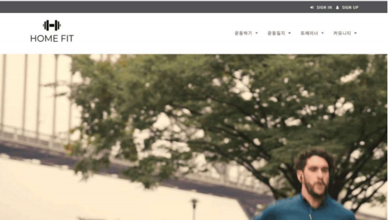

# HomeFit

   
  
   

 

## 프로젝트 소개

▶내용 : 홈 트레이닝 & 트레이너 매칭 사이트  
▶담당업무 : 
  프로젝트 리더, PPT & 와이어프레임 작성, 로그인(회원가입) 구현, 전반적인 UI 구현, 
  트레이너 신청 · 소개 게시판 구현, 1:1 채팅 시스템 구현, 바디프로필 게시판 구현, 전체 코드 병합 

 

## 기술 스택
</a>&nbsp;
</a>&nbsp;
</a>&nbsp;
 
</a>&nbsp;
</a>&nbsp;
</a>&nbsp;
 
</a>&nbsp;
</a>&nbsp;
  

 
